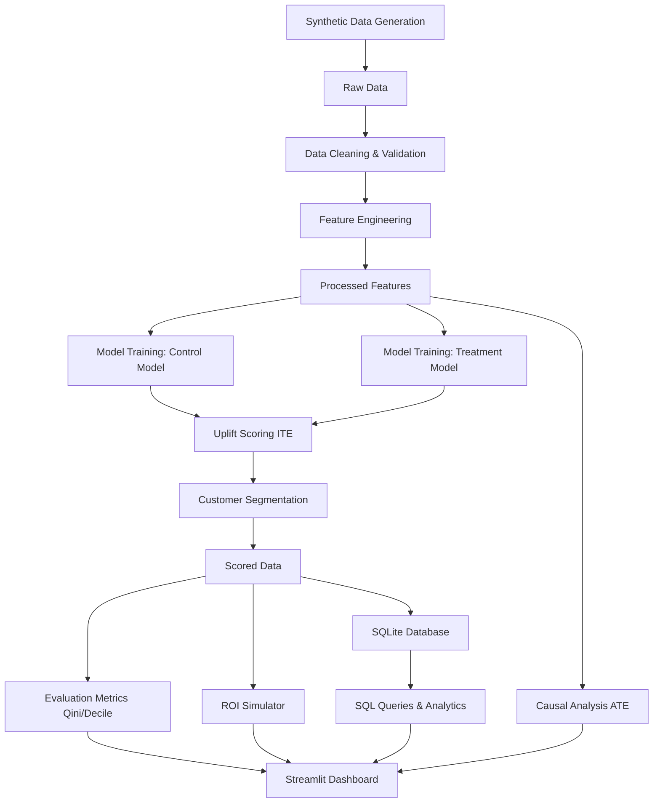

# Architecture Diagram

This document outlines the high-level architecture and data flow of the Marketing Campaign Causal Lift platform.

## Layers
1. **Data Layer:** `src/data_generation.py`, `src/data_cleaning.py`, `src/feature_engineering.py`
2. **Modeling Layer:** `src/causal_analysis.py`, `src/uplift_model.py`
3. **Business Logic Layer:** `src/segmentation.py`, `src/evaluation.py`, `src/roi_simulator.py`
4. **Data Storage Layer:** `sql/setup_db.py`, SQLite `campaign.db`
5. **Presentation Layer:** `app/streamlit_app.py`
